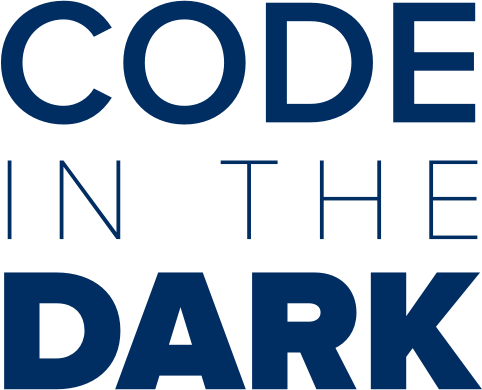

#Code In The Dark Platform

Implementation of code in the dark platform running on top of a laravel app. 
Ready to be deployed and used.

Leverages dropbox as the main storage mean.

### Deploying

You'll need to create a Dropbox App to get an App Secret and an Access Token.
Your app only needs permission to one directory. 

Rename the .env.example file to .env and place the dropbox keys where appropriate.

Direct participants to the `/` and hack away. 
